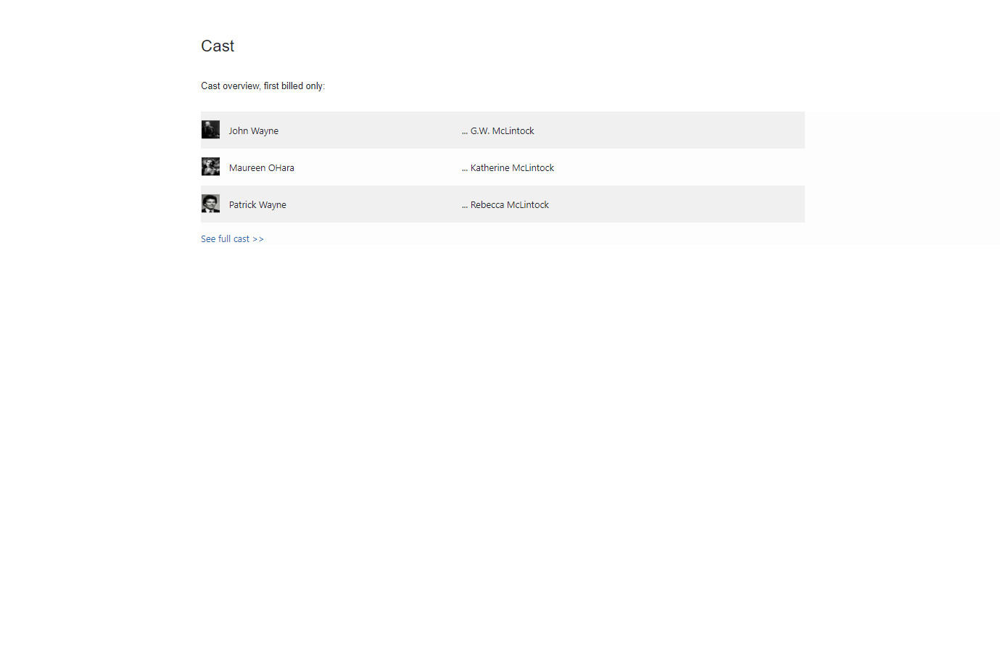
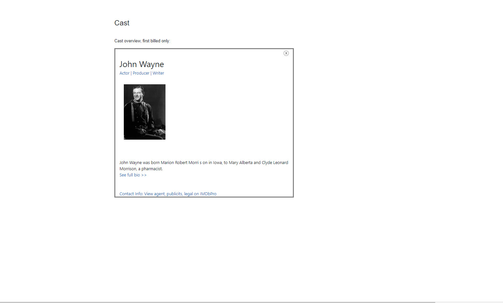
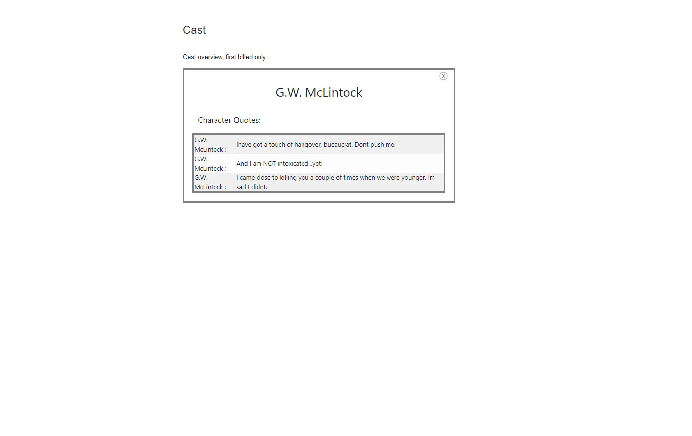

# N-Cast-Service

Technical Requirements/dependencies
 - Client: React, Webpack/Babel, Bootstrap 
 - Server: Express, Nodemon 
 - Database: PostgreSQL 

To Get Data:
install postgres and then run the script 'npm run database'

To Run Application:
 - run server script
 - run build script
 - exists on localhost:3003

Features Include:

Homepage     -Displays a table that contains actor image, actor name, and character name

Actor Page    - Displays actor name, description, image

Character Page    - Displays character name and quotes

    Future Features/Tasks:
      - add in missing data in the actor page
      - flesh out more functionality on the actor page
      - clean up the modal implemenation over the 'Cast' title
      - apply a proxy server to mix in the other services